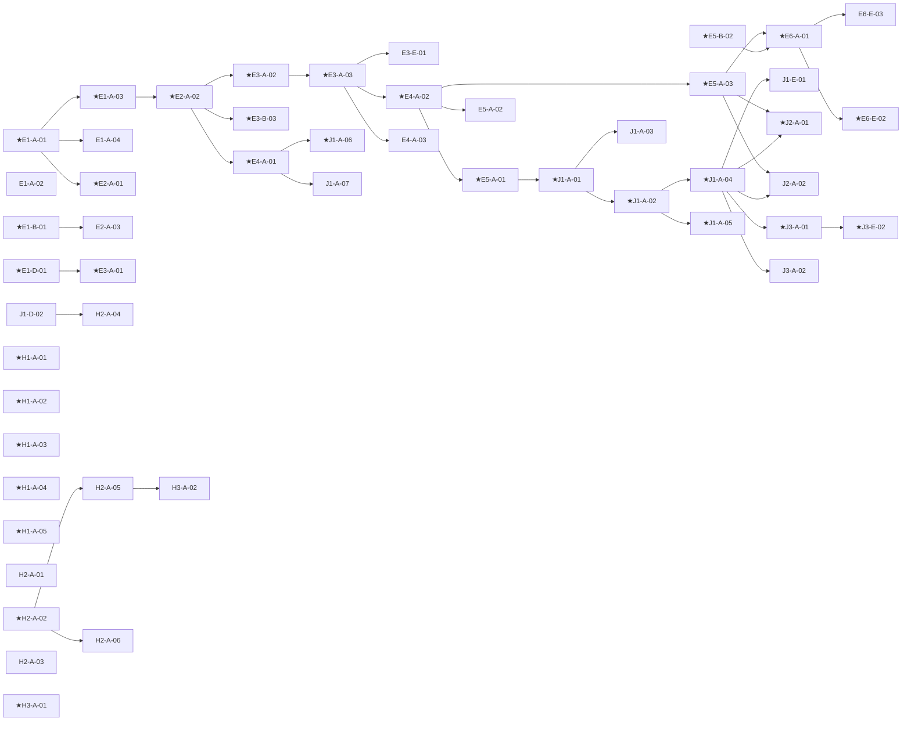
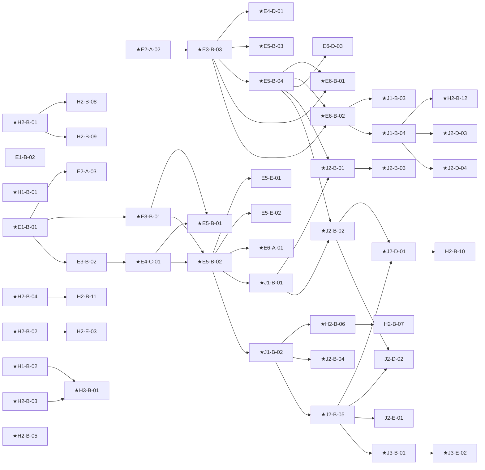
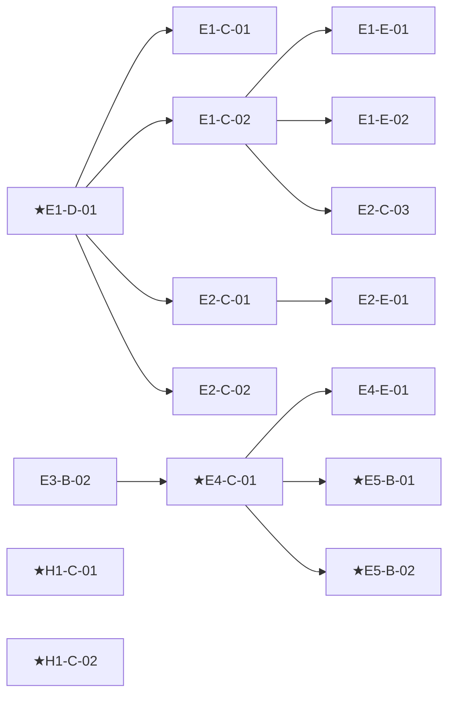
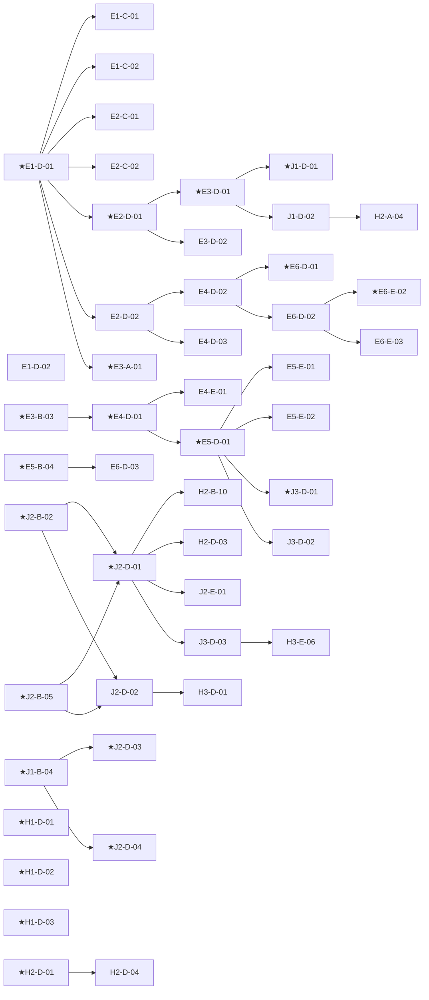
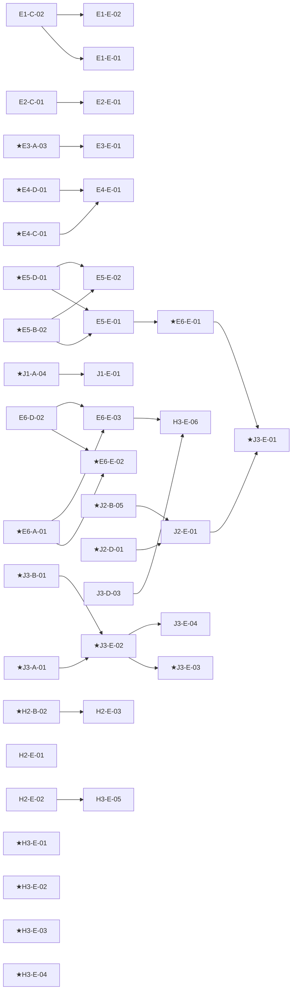
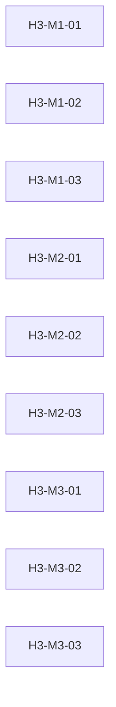

# 到達目標トレーサビリティ（自動生成）

`data/goals.json` から `tools/build_traceability.py` が生成する閲覧用ビュー。**手編集しない**こと（単元表の変更 → `extract_goals.py` → 本スクリプトの順で再生成）。

## 学年別サマリー

| 学年 | 目標数 | ★コア | 被参照（後続学年から前提として参照される数） |
|---|---|---|---|
| 小1 (E1) | 12 | 4 | 11 |
| 小2 (E2) | 9 | 3 | 7 |
| 小3 (E3) | 9 | 6 | 12 |
| 小4 (E4) | 8 | 4 | 10 |
| 小5 (E5) | 10 | 7 | 15 |
| 小6 (E6) | 9 | 6 | 4 |
| 中1 (J1) | 14 | 10 | 13 |
| 中2 (J2) | 12 | 9 | 6 |
| 中3 (J3) | 10 | 6 | 1 |
| 高1 (H1) | 12 | 12 | 1 |
| 高2 (H2) | 24 | 9 | 3 |
| 高3 (H3) | 19 | 6 | 0 |

## 領域別 前提関係グラフ

矢印は「前提 → 目標」。★はコア目標。領域をまたぐ前提は両方の領域の図に現れる。

### A コンピューティングとプログラミング

### B データとAI

### C 情報デザインとコミュニケーション

### D デジタル・シティズンシップと倫理

### E 探究と社会実装

### M 高3選択モジュール

前提のID参照を持たない独立目標のみ（高3モジュールの前提は「コアP1修了」＝9.3参照）。

## 学年差3以上の前提参照（付録A.3の開示対象）

スパイラル構造上の意図した積み上げ。該当単元は接続欄（3.4）で前提を再活性化する。

| 目標 | 前提 | 学年差 |
|---|---|---|
| E6-B-01 | E3-B-03 | 3 |
| E6-B-02 | E3-B-03 | 3 |
| H2-A-04 | J1-D-02 | 4 |
| H2-B-06 | J1-B-02 | 4 |
| H2-B-10 | J2-D-01 | 3 |
| H2-B-12 | J1-B-04 | 4 |
| H2-D-03 | J2-D-01 | 3 |
| H3-D-01 | J2-D-02 | 4 |
| H3-E-06 | E6-E-03 | 6 |
| H3-E-06 | J3-D-03 | 3 |
| J1-A-06 | E4-A-01 | 3 |
| J1-A-07 | E4-A-01 | 3 |
| J1-D-01 | E3-D-01 | 4 |
| J1-D-02 | E3-D-01 | 4 |
| J2-A-01 | E5-A-03 | 3 |
| J2-A-02 | E5-A-03 | 3 |
| J2-B-01 | E5-B-04 | 3 |
| J2-B-02 | E5-B-04 | 3 |
| J3-D-01 | E5-D-01 | 4 |
| J3-D-02 | E5-D-01 | 4 |
| J3-E-01 | E6-E-01 | 3 |

## 全目標インデックス

| ID | ★ | 観点 | 評価 | 前提 | この目標を前提とする目標 |
|---|---|---|---|---|---|
| E1-A-01 | ★ | 知 | 実技チェック・観察 | ― | E1-A-03, E1-A-04, E2-A-01 |
| E1-A-02 |  | 思 | 実技チェック・観察 | ― | ― |
| E1-A-03 | ★ | 知 | 実技チェック | E1-A-01 | E2-A-02 |
| E1-A-04 |  | 思 | 実技チェック | E1-A-01 | ― |
| E1-B-01 | ★ | 知 | 確認問題（口頭） | ― | E2-A-03, E3-B-01, E3-B-02 |
| E1-B-02 |  | 思 | 確認問題（口頭） | ― | ― |
| E1-C-01 |  | 知 | 実技チェック・観察 | E1-D-01 | ― |
| E1-C-02 |  | 思 | 実技チェック・観察 | E1-D-01 | E1-E-01, E1-E-02, E2-C-03 |
| E1-D-01 | ★ | 知 | 実技チェック・PF | ― | E1-C-01, E1-C-02, E2-C-01, E2-C-02, E2-D-01, E2-D-02, E3-A-01 |
| E1-D-02 |  | 学 | 実技チェック・PF | ― | ― |
| E1-E-01 |  | 思 | PT（ミニ発表）・観察 | E1-C-02 | ― |
| E1-E-02 |  | 学 | PT（ミニ発表）・観察 | E1-C-02 | ― |
| E2-A-01 | ★ | 知 | 実技チェック | E1-A-01 | ― |
| E2-A-02 | ★ | 知 | 観察・口頭確認 | E1-A-03 | E3-A-02, E3-B-03, E4-A-01 |
| E2-A-03 |  | 思 | 実技チェック | E1-B-01 | ― |
| E2-C-01 |  | 知 | 実技チェック・PF | E1-D-01 | E2-E-01 |
| E2-C-02 |  | 学 | 実技チェック・PF | E1-D-01 | ― |
| E2-C-03 |  | 思 | 口頭確認 | E1-C-02 | ― |
| E2-D-01 | ★ | 知 | 確認問題（場面選択） | E1-D-01 | E3-D-01, E3-D-02 |
| E2-D-02 |  | 思 | 確認問題（場面選択） | E1-D-01 | E4-D-02, E4-D-03 |
| E2-E-01 |  | 思 | PT・PF | E2-C-01 | ― |
| E3-A-01 | ★ | 知 | 実技チェック（時間計測） | E1-D-01 | ― |
| E3-A-02 | ★ | 知 | 実技チェック | E2-A-02 | E3-A-03 |
| E3-A-03 | ★ | 思 | 実技チェック・口頭 | E3-A-02 | E3-E-01, E4-A-02, E4-A-03 |
| E3-B-01 | ★ | 知 | 確認問題・PT | E1-B-01 | E5-B-01, E5-B-02 |
| E3-B-02 |  | 思 | 確認問題・PT | E1-B-01 | E4-C-01 |
| E3-B-03 | ★ | 思 | 観察・口頭確認 | E2-A-02 | E4-D-01, E5-B-03, E5-B-04, E6-B-01, E6-B-02 |
| E3-D-01 | ★ | 知 | 確認問題・実技 | E2-D-01 | J1-D-01, J1-D-02 |
| E3-D-02 |  | 知 | 確認問題・実技 | E2-D-01 | ― |
| E3-E-01 |  | 思 | PT・PF | E3-A-03 | ― |
| E4-A-01 | ★ | 知 | 確認問題（図解穴埋め） | E2-A-02 | J1-A-06, J1-A-07 |
| E4-A-02 | ★ | 知 | 実技チェック・観察 | E3-A-03 | E5-A-01, E5-A-02, E5-A-03 |
| E4-A-03 |  | 思 | 実技チェック・観察 | E3-A-03 | ― |
| E4-C-01 | ★ | 思 | PT・ルーブリック | E3-B-02 | E4-E-01, E5-B-01, E5-B-02 |
| E4-D-01 | ★ | 思 | PT（比較ワーク） | E3-B-03 | E4-E-01, E5-D-01 |
| E4-D-02 |  | 思 | 観察・PF | E2-D-02 | E6-D-01, E6-D-02 |
| E4-D-03 |  | 学 | 観察・PF | E2-D-02 | ― |
| E4-E-01 |  | 思 | PT（GRASPS簡易版） | E4-C-01, E4-D-01 | ― |
| E5-A-01 | ★ | 知 | 実技チェック・確認問題 | E4-A-02 | J1-A-01 |
| E5-A-02 |  | 思 | 実技チェック・確認問題 | E4-A-02 | ― |
| E5-A-03 | ★ | 知 | 実技チェック | E4-A-02 | E6-A-01, J2-A-01, J2-A-02 |
| E5-B-01 | ★ | 思 | PT・ルーブリック | E4-C-01, E3-B-01 | ― |
| E5-B-02 | ★ | 思 | PT・ルーブリック | E4-C-01, E3-B-01 | E5-E-01, E5-E-02, E6-A-01, J1-B-01, J1-B-02 |
| E5-B-03 | ★ | 知 | PT（実験レポート） | E3-B-03 | ― |
| E5-B-04 | ★ | 思 | PT（実験レポート） | E3-B-03 | E6-B-01, E6-B-02, E6-D-03, J2-B-01, J2-B-02 |
| E5-D-01 | ★ | 知 | 確認問題・成果物点検 | E4-D-01 | E5-E-01, E5-E-02, J3-D-01, J3-D-02 |
| E5-E-01 |  | 思 | PT（GRASPS）・PF | E5-B-02, E5-D-01 | E6-E-01 |
| E5-E-02 |  | 学 | PT（GRASPS）・PF | E5-B-02, E5-D-01 | ― |
| E6-A-01 | ★ | 思 | PT・実技 | E5-A-03, E5-B-02 | E6-E-02, E6-E-03 |
| E6-B-01 | ★ | 知 | PF（AI利用記録） | E3-B-03, E5-B-04 | ― |
| E6-B-02 | ★ | 思 | PF（AI利用記録） | E3-B-03, E5-B-04 | J1-B-03, J1-B-04 |
| E6-D-01 | ★ | 知 | 確認問題・成果物点検 | E4-D-02 | ― |
| E6-D-02 |  | 知 | 確認問題・成果物点検 | E4-D-02 | E6-E-02, E6-E-03 |
| E6-D-03 |  | 思 | 討議観察・記述 | E5-B-04 | ― |
| E6-E-01 | ★ | 思 | PT・ルーブリック | E5-E-01 | J3-E-01 |
| E6-E-02 | ★ | 思 | PT（GRASPS）・PF | E6-A-01, E6-D-02 | ― |
| E6-E-03 |  | 学 | PT（GRASPS）・PF | E6-A-01, E6-D-02 | H3-E-06 |
| J1-A-01 | ★ | 知 | 実技チェック | E5-A-01 | J1-A-02, J1-A-03 |
| J1-A-02 | ★ | 知 | 実技・確認問題 | J1-A-01 | J1-A-04, J1-A-05 |
| J1-A-03 |  | 思 | 実技・確認問題 | J1-A-01 | ― |
| J1-A-04 | ★ | 思 | 実技チェック | J1-A-02 | J1-E-01, J2-A-01, J2-A-02, J3-A-01, J3-A-02 |
| J1-A-05 | ★ | 思 | 実技チェック | J1-A-02 | ― |
| J1-A-06 | ★ | 知 | 確認問題 | E4-A-01 | ― |
| J1-A-07 |  | 知 | 確認問題 | E4-A-01 | ― |
| J1-B-01 | ★ | 知 | 実技・PT | E5-B-02 | J2-B-01, J2-B-02 |
| J1-B-02 | ★ | 思 | 実技・PT | E5-B-02 | H2-B-06, J2-B-04, J2-B-05 |
| J1-B-03 | ★ | 知 | PT（検証レポート） | E6-B-02 | ― |
| J1-B-04 | ★ | 思 | PT（検証レポート） | E6-B-02 | H2-B-12, J2-D-03, J2-D-04 |
| J1-D-01 | ★ | 知 | 確認問題・実技 | E3-D-01 | ― |
| J1-D-02 |  | 知 | 確認問題・実技 | E3-D-01 | H2-A-04 |
| J1-E-01 |  | 思 | PT・PF | J1-A-04 | ― |
| J2-A-01 | ★ | 思 | PT・実技 | E5-A-03, J1-A-04 | ― |
| J2-A-02 |  | 思 | PT・実技 | E5-A-03, J1-A-04 | ― |
| J2-B-01 | ★ | 知 | 実技・確認問題 | E5-B-04, J1-B-01 | J2-B-03 |
| J2-B-02 | ★ | 思 | 実技・確認問題 | E5-B-04, J1-B-01 | J2-D-01, J2-D-02 |
| J2-B-03 | ★ | 知 | 確認問題 | J2-B-01 | ― |
| J2-B-04 | ★ | 思 | PT（記事批評） | J1-B-02 | ― |
| J2-B-05 | ★ | 思 | PT（記事批評） | J1-B-02 | J2-D-01, J2-D-02, J2-E-01, J3-B-01 |
| J2-D-01 | ★ | 思 | 討議・記述ルーブリック | J2-B-02, J2-B-05 | H2-B-10, H2-D-03, J2-E-01, J3-D-03 |
| J2-D-02 |  | 思 | 討議・記述ルーブリック | J2-B-02, J2-B-05 | H3-D-01 |
| J2-D-03 | ★ | 知 | 成果物点検 | J1-B-04 | ― |
| J2-D-04 | ★ | 知 | 成果物点検 | J1-B-04 | ― |
| J2-E-01 |  | 思 | PT・PF | J2-B-05, J2-D-01 | J3-E-01 |
| J3-A-01 | ★ | 知 | 実技・PT | J1-A-04 | J3-E-02 |
| J3-A-02 |  | 思 | 実技・PT | J1-A-04 | ― |
| J3-B-01 | ★ | 思 | PT | J2-B-05 | J3-E-02 |
| J3-D-01 | ★ | 知 | 確認問題・成果物点検 | E5-D-01 | ― |
| J3-D-02 |  | 知 | 確認問題・成果物点検 | E5-D-01 | ― |
| J3-D-03 |  | 思 | 記述・PF | J2-D-01 | H3-E-06 |
| J3-E-01 | ★ | 思 | PT・ルーブリック | E6-E-01, J2-E-01 | ― |
| J3-E-02 | ★ | 思 | PT・実技 | J3-A-01, J3-B-01 | J3-E-03, J3-E-04 |
| J3-E-03 | ★ | 思 | PT（GRASPS）・観察 | J3-E-02 | ― |
| J3-E-04 |  | 学 | PT（GRASPS）・観察 | J3-E-02 | ― |
| H1-A-01 | ★ | 知 | 章末演習（共通テスト形式）・実技 | ― | ― |
| H1-A-02 | ★ | 思 | 章末演習（共通テスト形式）・実技 | ― | ― |
| H1-A-03 | ★ | 思 | 章末演習（共通テスト形式）・実技 | ― | ― |
| H1-A-04 | ★ | 思 | 章末演習（共通テスト形式）・実技 | ― | ― |
| H1-A-05 | ★ | 知 | 章末演習・PT（データ分析レポート） | ― | ― |
| H1-B-01 | ★ | 思 | 章末演習・PT（データ分析レポート） | ― | ― |
| H1-B-02 | ★ | 知 | 章末演習・PT（データ分析レポート） | ― | H3-B-01 |
| H1-C-01 | ★ | 知 | 章末演習・PT（制作＋改善記録） | ― | ― |
| H1-C-02 | ★ | 思 | 章末演習・PT（制作＋改善記録） | ― | ― |
| H1-D-01 | ★ | 思 | 章末演習・PT（AI活用レポート） | ― | ― |
| H1-D-02 | ★ | 知 | 章末演習・PT（AI活用レポート） | ― | ― |
| H1-D-03 | ★ | 思 | 章末演習・PT（AI活用レポート） | ― | ― |
| H2-A-01 |  | 思 | 確認問題・実技 | ― | ― |
| H2-A-02 | ★ | 知 | 実技・チームPT | ― | H2-A-05, H2-A-06 |
| H2-A-03 |  | 思 | 実技・チームPT | ― | ― |
| H2-A-04 |  | 知 | 実技チェック | J1-D-02 | ― |
| H2-A-05 |  | 知 | 成果物点検 | H2-A-02 | H3-A-02 |
| H2-A-06 |  | 思 | 観察・PF | H2-A-02 | ― |
| H2-B-01 | ★ | 知 | 実技・PT（分析コンペ形式） | ― | H2-B-08, H2-B-09 |
| H2-B-02 | ★ | 思 | 実技・PT（分析コンペ形式） | ― | H2-E-03 |
| H2-B-03 | ★ | 思 | 実技・PT（分析コンペ形式） | ― | H3-B-01 |
| H2-B-04 | ★ | 知 | 確認問題・実技 | ― | H2-B-11 |
| H2-B-05 | ★ | 知 | 確認問題・実技 | ― | ― |
| H2-B-06 | ★ | 知 | 実技・成果物点検 | J1-B-02 | H2-B-07 |
| H2-B-07 |  | 思 | PT | H2-B-06 | ― |
| H2-B-08 |  | 思 | 確認問題・PT | H2-B-01 | ― |
| H2-B-09 |  | 思 | 実技 | H2-B-01 | ― |
| H2-B-10 |  | 学 | PF・観察 | J2-D-01 | ― |
| H2-B-11 |  | 知 | 確認問題 | H2-B-04 | ― |
| H2-B-12 | ★ | 思 | PT | J1-B-04 | ― |
| H2-D-01 | ★ | 思 | PT（リスク評価書） | ― | H2-D-04 |
| H2-D-03 |  | 知 | 確認問題 | J2-D-01 | ― |
| H2-D-04 |  | 思 | PT | H2-D-01 | ― |
| H2-E-01 |  | 思 | PT・PF | ― | ― |
| H2-E-02 |  | 学 | PF・観察 | ― | H3-E-05 |
| H2-E-03 |  | 思 | PT（発表ルーブリック） | H2-B-02 | ― |
| H3-A-01 | ★ | 思 | 実技・進捗レビュー2回 | ― | ― |
| H3-A-02 |  | 知 | 成果物点検 | H2-A-05 | ― |
| H3-B-01 | ★ | 思 | PT | H1-B-02, H2-B-03 | ― |
| H3-D-01 |  | 思 | 小論文ルーブリック | J2-D-02 | ― |
| H3-E-01 | ★ | 思 | PT（計画書審査） | ― | ― |
| H3-E-02 | ★ | 思 | 実技・進捗レビュー2回 | ― | ― |
| H3-E-03 | ★ | 思 | PT | ― | ― |
| H3-E-04 | ★ | 思 | PT（公開実績＋小論文ルーブリック） | ― | ― |
| H3-E-05 |  | 学 | 観察・PF | H2-E-02 | ― |
| H3-E-06 |  | 学 | PF | E6-E-03, J3-D-03 | ― |
| H3-M1-01 |  | 知 | 確認問題 | ― | ― |
| H3-M1-02 |  | 思 | PT | ― | ― |
| H3-M1-03 |  | 思 | 記述ルーブリック | ― | ― |
| H3-M2-01 |  | 知 | 確認問題・実技 | ― | ― |
| H3-M2-02 |  | 思 | 成果物点検 | ― | ― |
| H3-M2-03 |  | 思 | 成果物点検 | ― | ― |
| H3-M3-01 |  | 知 | 確認問題 | ― | ― |
| H3-M3-02 |  | 思 | PT・講評 | ― | ― |
| H3-M3-03 |  | 思 | 成果物点検 | ― | ― |

